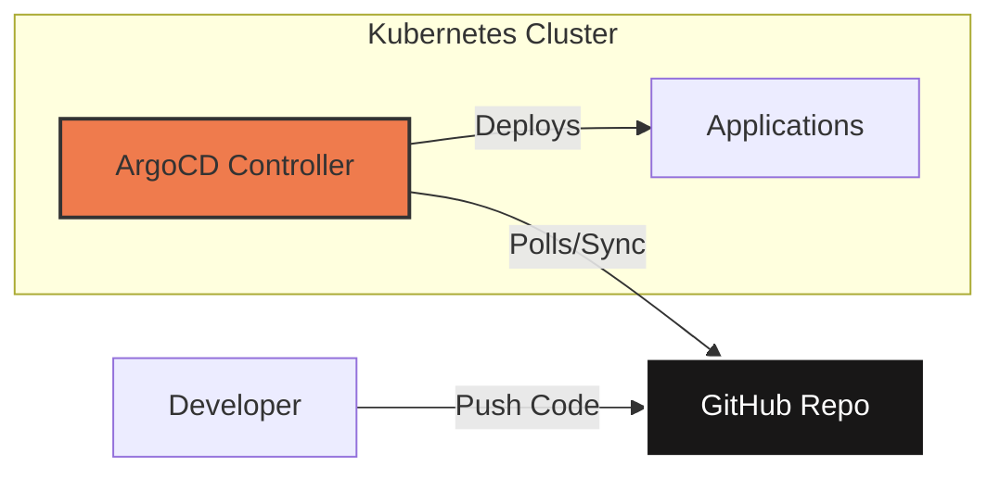

# Inception of Things

> **Automated Kubernetes Infrastructure with GitOps** — From VM to continuous deployment in one click.

---

## Why this project?

Project designed to master container orchestration and **modern DevOps** practices:
- Provision Kubernetes clusters from scratch
- Implement a complete **GitOps** pipeline with ArgoCD
- Automate infrastructure with Infrastructure as Code



---

## Tech Stack


---

## Features

| Part | Description |
|------|-------------|
| **P1** | Multi-node K3s cluster (Server + Worker) provisioned via Vagrant |
| **P2** | Smart routing: 3 applications, 1 Ingress Controller, hostname-based routing |
| **P3** | Automated GitOps deployment with ArgoCD (GitHub → K3d Cluster sync) |
| **Bonus** | Complete pipeline with self-hosted GitLab + ArgoCD in the same cluster |

---

## Prerequisites

| Parts | Required Tools |
|-------|---------------|
| **P1 / P2** | [Vagrant](https://www.vagrantup.com/) + [VirtualBox](https://www.virtualbox.org/) |
| **P3 / Bonus** | [Docker](https://www.docker.com/) + [kubectl](https://kubernetes.io/docs/tasks/tools/) |

---

## Quickstart

```bash
# Part 1 - Multi-node K3s cluster
cd p1 && make

# Part 2 - Multi-app routing with Ingress
cd p2 && make

# Part 3 - GitOps with ArgoCD + GitHub
cd p3 && make install

# Bonus - Self-hosted GitLab + ArgoCD
cd bonus && make install
```

**Access services (P3/Bonus):**
```bash
make info          # Display ArgoCD & GitLab credentials
make port-forward  # ArgoCD UI → https://localhost:8080
make test          # Test app → http://localhost:8888
```

---

## Project Structure

```
.
├── p1/                      # K3s Server/Worker cluster (Vagrant)
│   ├── Vagrantfile
│   └── Makefile
│
├── p2/                      # 3 apps + Ingress routing (K3s)
│   ├── Vagrantfile
│   ├── Makefile
│   └── confs/
│       ├── app-one.yaml
│       ├── app-two.yaml
│       ├── app-three.yaml
│       └── ingress.yaml
│
├── p3/                      # ArgoCD + GitHub sync (K3d)
│   ├── Makefile
│   ├── scripts/
│   │   └── install.sh
│   ├── confs/
│   │   └── application.yaml
│   └── app/
│       ├── deployment.yaml
│       ├── service.yaml
│       └── ingress.yaml
│
└── bonus/                   # Self-hosted GitLab + ArgoCD
    ├── Makefile
    ├── scripts/
    │   └── install.sh
    ├── confs/
    │   ├── application.yaml
    │   └── gitlab-values.yaml
    └── app/
        ├── deployment.yaml
        ├── service.yaml
        └── ingress.yaml
```

---

## Parts Details

### Part 1 — Multi-node K3s Cluster

Automatic provisioning of 2 VMs with Vagrant:
- **Server**: K3s master node (API Server, Scheduler, etcd)
- **Worker**: Agent node that joins the cluster via token

```bash
cd p1
make          # Start VMs
make ssh-s    # SSH to Server
make ssh-w    # SSH to Worker
make clean    # Destroy VMs
```

### Part 2 — Ingress Routing

Deployment of 3 applications with hostname-based HTTP routing:

| Hostname | Application | Replicas |
|----------|-------------|----------|
| `app1.com` | app-one | 1 |
| `app2.com` | app-two | 3 |
| `default` | app-three | 1 |

```bash
cd p2
make                                    # Start cluster
vagrant ssh                             # Access VM
curl -H "Host: app1.com" localhost      # → app-one
curl -H "Host: app2.com" localhost      # → app-two
curl localhost                          # → app-three (default)
```

### Part 3 — GitOps with ArgoCD

ArgoCD monitors the GitHub repo and automatically syncs changes:

```bash
cd p3
make install       # Create K3d cluster + install ArgoCD
make info          # Display credentials
make port-forward  # Expose ArgoCD UI on localhost:8080
make sync          # Force synchronization
```

**GitOps Demo:**
```bash
# Modify app version
sed -i 's/v1/v2/' app/deployment.yaml
git add . && git commit -m "Update to v2" && git push
# ArgoCD detects and deploys automatically!
```

### Bonus — Self-Hosted GitLab

Complete GitOps pipeline with GitLab hosted in the cluster:

```bash
cd bonus
make install       # Install GitLab + ArgoCD
make info          # GitLab & ArgoCD credentials
```
